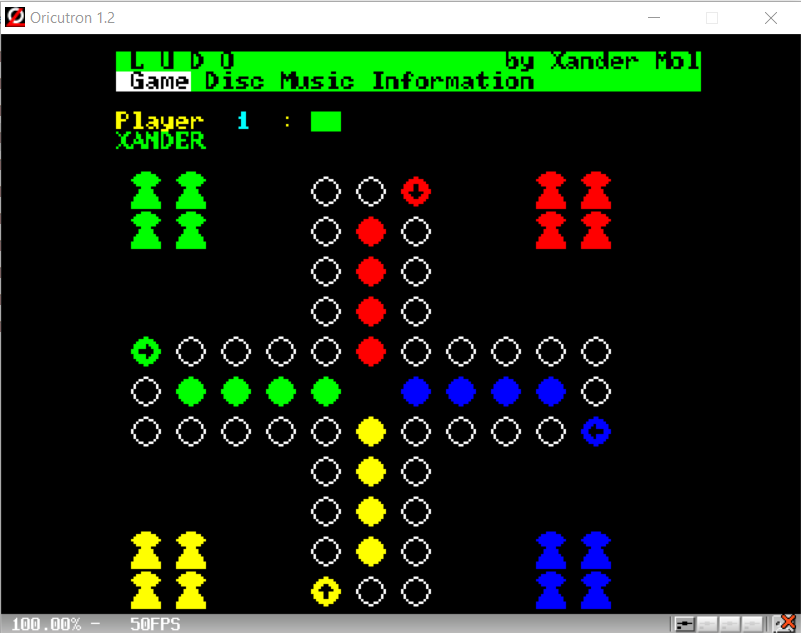

# LUDO
Ludo game for 8 bit computers. By Xander Mol.
(C) 2020 for Oric Atmos, (C) 1992 for Commodore 128

Latest build for Oric Atmos:

- DSK version:
  https://github.com/xahmol/ludo/raw/v0.8-alpha/Oric%20Atmos/BUILD/LUDO.dsk
- HFE version (for Cumana Reborn):
  https://github.com/xahmol/ludo/raw/v0.8-alpha/Oric%20Atmos/BUILD/LUDO_dsk.hfe

Original Commodore 128 version (in Dutch):

- D64 version:
  https://github.com/xahmol/ludo/raw/v0.8-alpha/C128/D64/mejn.d64

**Instructions for playing**:

The game is menu driven. For menu navigation, use the cursor keys (up, down, left, right) and press ENTER to select. Active choice has a white background in the main menu bar, yellow in the pull down menus. If the main menu bar shows no white hightlighted options, no menu choices are possible, the computer is busy executing game turn actions.
Popups wait for a keypress, for this any key will work. Joystick is also possible for the C128 version, but not yet implemented for the Oric Atmos version. Mouse not supported.

The game uses the LUDO rules from the Dutch 'Mens Erger je Niet' variant as played by my family 30 years ago, so probably there are some 'house rules' interpretations that are not the same as the present official game manual, like what is allowed after a six is thrown depending on how many pawns are already on the board. Example: after throwing a six, moving the newly placed pawn with the next dice throw is obligatory, also if this would attack another pawn of the same player. Exception is if all pawns are on the board, moving the new pawn is in that case optional. As the game only allows valid moves, this should indicate itself.

Please let me know if the game interpretations are inconsistent, incorrect or not working.

Enjoy!

**Screenshots of Oric Atmos version**:

**Credits**:

Original written in 1992 on the Commodore 128, converted in 2020 to the Oric Atmos.

Oric version build with and using code from OSDK (https://osdk.org/). [Copyright](https://osdk.org/index.php?page=documentation&subpage=copyright).

Music player routine used from https://osdk.org/index.php?page=articles&ref=ART5

Original windowing system code on Commodore 128 by unknown author.

Music credits:

- R-Type level 1 by Wally Beben/Alain Derpin
- Axel F by Jochen Hippel/ Oedipus
- Wizzball by Peter Johnson/Aldn.

Documentation used:

- [OSDK.org]() 
- [forum.defence-force.org]()
- [defence-force.org]()

Oric development tooling used (next to OSDK):

- CD2 from Twilighte http://twilighte.oric.org/twinew/start.htm
- Oric Explorer by Scott Davies https://github.com/oric-software/OricExplorer
- ORIC Character Generater by Pe@ceR https://forum.defence-force.org/viewtopic.php?t=1695
- HxCFloppyEmulator Software by Jean-Francois del Nero https://hxc2001.com/download/floppy_drive_emulator/HxCFloppyEmulator_soft.zip

Tooling to transfer original Commodore software code: 

- VICE by VICE authors https://vice-emu.sourceforge.io/
- DirMaster by The Wiz/Elwix https://style64.org/dirmaster
- CharPad Free by Subchrist software https://subchristsoftware.itch.io/charpad-free-edition
- UltimateII+ cartridge by Gideon Zweijtzer https://ultimate64.com/U2P_Cartridge_Black

Tested using Oricuton emulator and an Oric Atmos with a Cumana Reborn.

Thanks for reading and enjoy playing!

Xander Mol
